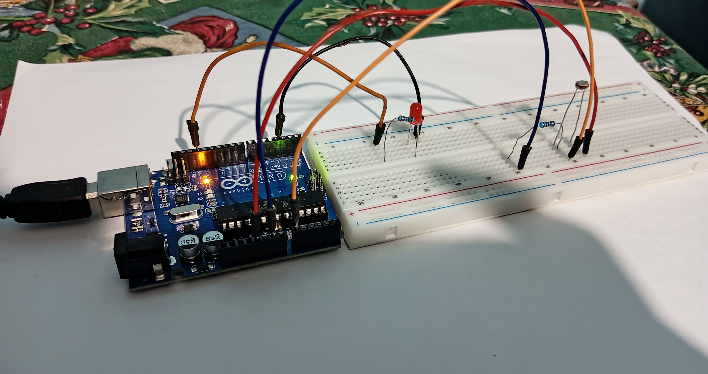

# 💡 LDR Light-Controlled LED

This project demonstrates the basic operation of a **Light Dependent Resistor (LDR)**
using a **voltage divider circuit**. An LED is controlled based on ambient light levels.

The system turns the LED **ON in darkness** and **OFF in bright conditions**.

---

## 🧠 Concept Overview

An LDR changes its resistance based on light intensity:

- **Bright light** → Low resistance
- **Darkness** → High resistance

By placing the LDR in a voltage divider, the output voltage varies with light level and
can be used to control an LED.

---

## ⚙️ How It Works

1. The LDR and a **10 kΩ resistor** form a voltage divider.
2. As light intensity decreases, the resistance of the LDR increases.
3. This causes the divider output voltage to rise.
4. When the measured voltage exceeds a preset threshold:
   - The LED turns **ON**
5. When the voltage drops below the threshold:
   - The LED turns **OFF**

---

## 🧰 Components Used

- Light Dependent Resistor (LDR)
- 10 kΩ resistor (approximate)
- LED
- 220 Ω resistor (LED current limiting)
- Arduino (for voltage measurement)
- Breadboard
- Jumper wires

---

## 🔌 Circuit Description

The LDR and 10 kΩ resistor are connected in series to form a voltage divider.
The divider output is connected to an **analog input pin** of the Arduino.

## 🔌 Circuit Design



---

## 📏 Threshold Logic

The LED is controlled based on the analog voltage reading:

```cpp
if (analogValue > 400) {
    LED ON;
} else {
    LED OFF;
}
